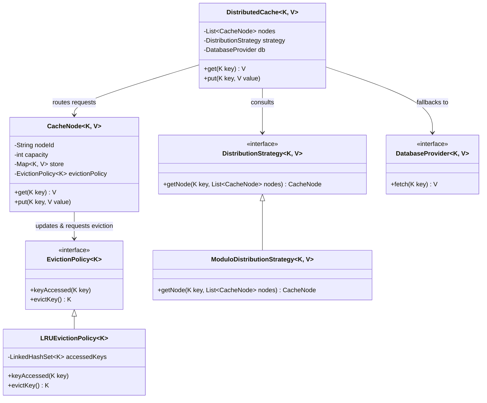

# Distributed Cache Implementation

This package implements an Object-Oriented design for a generic Distributed Cache system. It provides an extensible, feature-rich structure following SOLID principles.

## Features Met

1. **Pluggable Distribution Strategy:** Achieved via the `DistributionStrategy` interface. Implemented the standard `ModuloDistributionStrategy`, but `ConsistentHashingStrategy` could easily be added tomorrow without breaking the coordinator logic.
2. **Pluggable Eviction Policy:** Achieved via the `EvictionPolicy` interface. Implemented `LRUEvictionPolicy` using a `LinkedHashSet` for O(1) performance. Can easily swap to `LFU` or `FIFO`.
3. **Cache Miss Fallback:** The orchestrator implements the Cache-Aside pattern. Upon a cache miss, it seamlessly falls back to a simulated `DatabaseProvider`.
4. **Configurable Structure:** The orchestrator takes a parameterized list of `CacheNode`s allowing the cluster size to scale dynamically during initialization.

## Class Diagram

## How It Works

1. The client speaks directly to the `DistributedCache`.
2. When the client calls `put`, the cluster consults the `DistributionStrategy` which calculates the hash of the key to assign it to an exact physical `CacheNode`.
3. The individual `CacheNode` tracks its own specific memory limits. It adds the item to its local storage, and logs the access with its specialized `EvictionPolicy`.
4. If the node reaches capacity, it pauses the `put` action, asks the `EvictionPolicy` "Who was LRU?", cleanly deletes that old key, and then resumes adding the new package.
